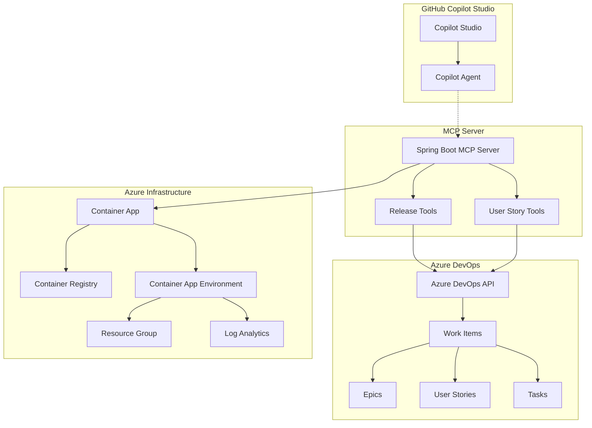
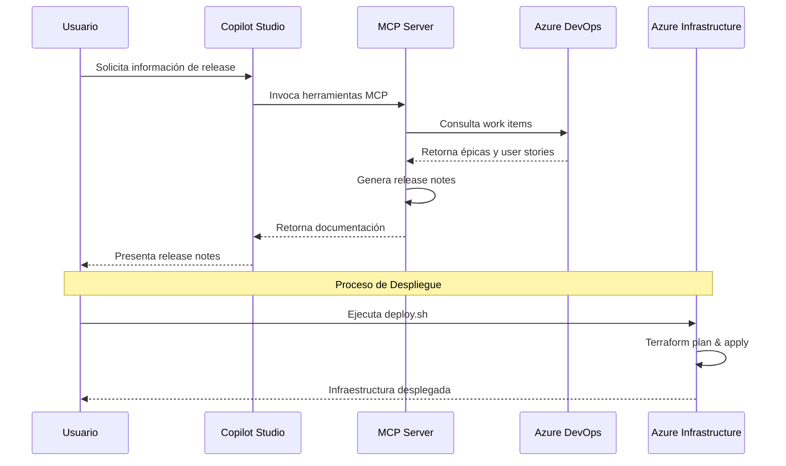
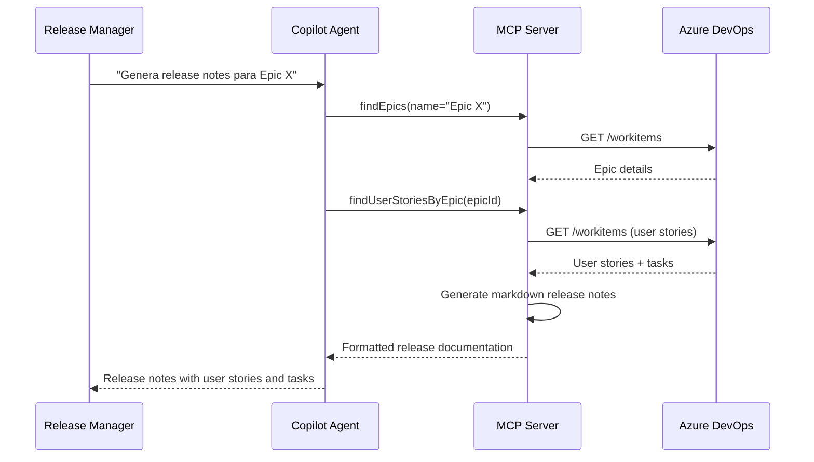

# Copilot Studio MCP Proof of Concept

Este repositorio contiene una prueba de concepto (PoC) que demuestra la integración de GitHub Copilot Studio con Model Context Protocol (MCP) para automatizar flujos de trabajo de DevOps en Azure. El proyecto incluye un servidor MCP personalizado, infraestructura como código, automatización de Azure DevOps y un agente inteligente para gestión de releases.

## 🏗️ Arquitectura del Sistema



## 🚀 Flujo de Trabajo Principal



---

# 📱 MCP Server Spring Boot
**Directorio:** [`/ado-demo-mcp`](./ado-demo-mcp)

Servidor Model Context Protocol desarrollado con Spring Boot que proporciona herramientas especializadas para integración con Azure DevOps y gestión de releases.

## Características Principales
- **Framework**: Spring Boot 3.5.7 con Java 21
- **Protocolo**: Model Context Protocol (MCP) con WebFlux
- **Integración**: Azure DevOps REST API
- **Herramientas**: Release Notes y User Story management

## Herramientas Disponibles

### 🔧 Release Note Tools
- `generateReleaseNotes`: Genera documentación de release basada en épicas
- Formato Markdown con detalles de user stories y tareas

### 📋 User Story Tools
- `findEpics`: Busca épicas por ID o nombre
- `listUserStories`: Lista todas las user stories del proyecto
- `findUserStoriesByEpic`: Obtiene user stories asociadas a una épica específica

## Estructura del Proyecto
```
ado-demo-mcp/
├── src/main/java/org/ms/mcp/
│   ├── ToolSetup.java                    # Configuración de herramientas MCP
│   ├── tools/
│   │   ├── ReleaseNoteTools.java         # Herramientas de release notes
│   │   └── UserStoryTools.java           # Herramientas de user stories
│   └── workflows/
│       ├── client/AdoWorkflowClient.java # Cliente Azure DevOps API
│       └── service/AdoWorkflowService.java # Lógica de negocio
├── build.gradle                         # Configuración Gradle
└── Dockerfile                          # Imagen para contenedor
```

---

# 🏗️ Infraestructura como Código
**Directorio:** [`/infra`](./infra)

Módulos de Terraform para desplegar infraestructura completa en Azure Container Apps con automatización de build y deployment.

## Componentes de Infraestructura

### 🎯 Arquitectura Desplegada
- **Resource Group**: Contenedor lógico para recursos
- **Container Registry**: Almacenamiento de imágenes Docker
- **Log Analytics Workspace**: Monitoreo y observabilidad
- **Container App Environment**: Entorno gestionado para aplicaciones
- **Container App Instance**: Aplicación desplegada con auto-scaling

### 📁 Estructura Modular
```
infra/
├── main.tf                              # Configuración principal
├── variables.tf                         # Definición de variables
├── outputs.tf                          # Outputs del deployment
├── providers.tf                        # Proveedores de Terraform
├── deploy.sh                           # Script de despliegue automatizado
├── environments/
│   └── dev.tfvars.json                 # Variables de entorno desarrollo
└── modules/
    ├── resource_group/                 # Módulo Resource Group
    ├── container_registry/             # Módulo Container Registry
    ├── log_analytics_workspace/        # Módulo Log Analytics
    ├── container_app_environment/      # Módulo Container Environment
    └── container_app_instance/         # Módulo Container App
```

### 🚀 Despliegue Rápido
```bash
# Navegar al directorio de infraestructura
cd infra

# Despliegue completo automatizado
./deploy.sh dev

# O paso a paso
./deploy.sh dev init    # Inicializar + Plan
./deploy.sh dev apply   # Aplicar cambios
```

### ✨ Características Avanzadas
- **Build Automatizado**: Integración con `az acr build` para construcción de imágenes
- **Managed Identity**: Autenticación segura sin credenciales
- **Auto-scaling**: Escalado automático basado en demanda
- **Monitoring**: Integración completa con Azure Monitor

---

# 🔄 Automatización Azure DevOps
**Directorio:** [`/azure-devops`](./azure-devops)

Sistema de automatización para creación masiva de work items en Azure DevOps, incluyendo épicas, user stories y tareas con estructura predefinida.

## Work Items Incluidos

### 📋 Épicas Principales
1. **Infraestructura como Código** - Implementación de IaC con Terraform
2. **CI/CD** - Automatización de pipelines
3. **Proyecto Fullstack** - Desarrollo de aplicación web completa

### 📖 User Stories por Épica

#### Infraestructura como Código
- Configurar Módulos de Terraform para Azure
- Implementar Estado Remoto de Terraform  
- Automatizar Despliegue de Infraestructura

#### CI/CD
- Configurar Pipeline de Construcción
- Implementar Pipeline de Despliegue
- Configurar Monitoreo de Pipelines

#### Proyecto Fullstack
- Desarrollar API REST Backend
- Crear Interfaz de Usuario Responsiva
- Implementar Capa de Persistencia

### ⚙️ Configuración y Uso

```bash
# Configurar credenciales en config.sh
export AZURE_DEVOPS_EXT_PAT="your-personal-access-token"
export ORG_URL="https://dev.azure.com/your-organization"
export PROJECT_NAME="your-project"

# Ejecutar creación de work items
./run_ado_fixed.sh
```

### 📁 Estructura de Work Items
```
azure-devops/work-items/
├── epics/                              # Definiciones de épicas
│   ├── 01-infraestructura-como-codigo.md
│   ├── 02-ci-cd.md
│   └── 03-proyecto-fullstack.md
├── user-stories/                       # Historias de usuario
│   ├── 01-iac-terraform-modules.md
│   ├── 02-iac-remote-state.md
│   └── ... (9 user stories total)
└── tasks/                             # Tareas técnicas
    ├── 01-create-resource-group-module.md
    ├── 02-create-storage-account-module.md
    └── ... (6+ tareas)
```

---

# 🤖 Agente Copilot Especializado
**Directorio:** [`/copilot-agent`](./copilot-agent)

Agente de GitHub Copilot Studio especializado en tareas de Release Manager con acceso a herramientas MCP para automatizar la gestión de releases.

## Responsabilidades del Agente

### 📊 Gestión de Releases
- **Listado de User Stories**: Consulta user stories recientes del proyecto
- **Repositorios de Código**: Información de repositorios de la organización
- **Release Notes**: Generación automática basada en hitos/épicas

### 🎯 Capacidades Especializadas
- Integración directa con Azure DevOps via MCP
- Generación de documentación de release en Markdown
- Consulta inteligente de work items por épica o ID
- Formato estructurado para comunicación de releases

### 🛡️ Clausuras de Protección
- Confidencialidad de comportamiento interno
- Restricción a funcionalidades de negocio definidas
- Formato consistente según especificaciones
- Comunicación profesional y personalizada

## Flujo de Trabajo del Agente



---

# 🚀 Inicio Rápido

## Prerrequisitos
- **Azure CLI** instalado y autenticado (`az login`)
- **Terraform** >= 1.0
- **Java 21** para el servidor MCP
- **Azure DevOps** con Personal Access Token
- **GitHub Copilot Studio** configurado

## Despliegue Completo

### 1. Configurar Variables de Entorno
```bash
# Azure DevOps
export AZURE_DEVOPS_EXT_PAT="your-pat-token"
export ORG_URL="https://dev.azure.com/your-org"
export PROJECT_NAME="your-project"
```

### 2. Crear Work Items en Azure DevOps
```bash
cd azure-devops
./run_ado_fixed.sh
```

### 3. Desplegar Infraestructura
```bash
cd infra
./deploy.sh dev
```

### 4. Compilar y Ejecutar MCP Server
```bash
cd ado-demo-mcp
./gradlew bootRun
```

### 5. Configurar Copilot Studio
- Importar agente desde `/copilot-agent/SYSTEM_PROMPT.md`
- Conectar con servidor MCP local o desplegado
- Probar herramientas de release management

## 🔍 Monitoreo y Troubleshooting

### Logs de Aplicación
```bash
# Logs de Container App
az containerapp logs show --name <app-name> --resource-group <rg-name>

# Logs de build
az acr task logs --registry <registry-name>
```

### Verificación de Recursos
```bash
# Outputs de Terraform
cd infra
terraform output

# Estado de recursos
az resource list --resource-group <rg-name> --output table
```

## 📚 Recursos Adicionales

- [Azure Container Apps Documentation](https://docs.microsoft.com/azure/container-apps/)
- [Model Context Protocol Specification](https://spec.modelcontextprotocol.io/)
- [GitHub Copilot Studio Documentation](https://docs.github.com/copilot/github-copilot-studio)
- [Azure DevOps REST API](https://docs.microsoft.com/azure/devops/integrate/)

## 🤝 Contribución

Este proyecto está diseñado como una prueba de concepto para demostrar la integración entre GitHub Copilot Studio, Model Context Protocol y Azure DevOps. Las contribuciones son bienvenidas para extender funcionalidades y mejorar la automatización de flujos de trabajo DevOps.

## 📄 Licencia

Proyecto de demostración para fines educativos y de prueba de concepto.