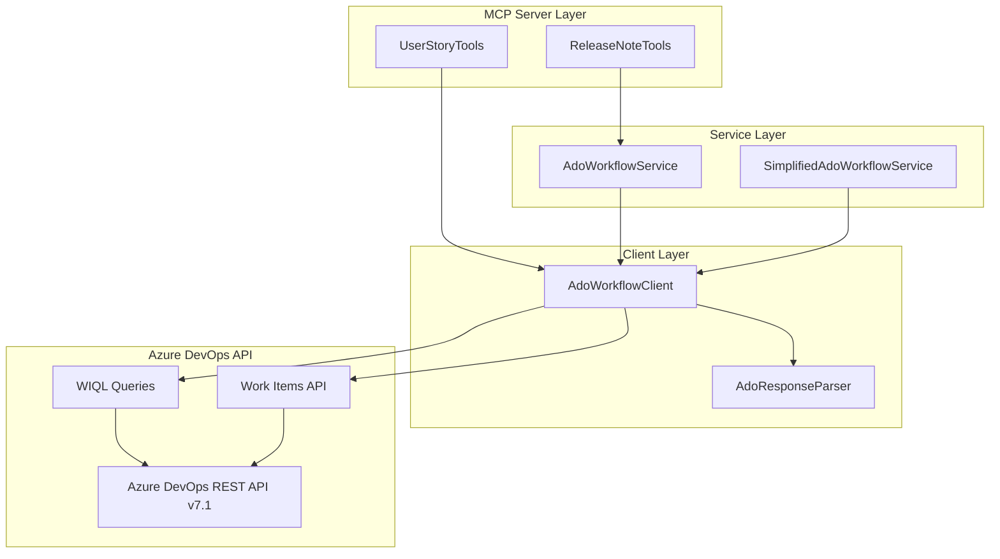
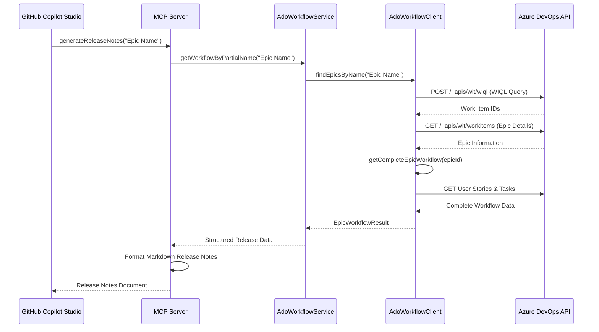

# Azure DevOps MCP Server

Servidor Model Context Protocol (MCP) desarrollado con Spring Boot que proporciona herramientas especializadas para integrar GitHub Copilot Studio con Azure DevOps. Permite consultar épicas, historias de usuario, tareas y generar release notes automáticamente.

## 🚀 Características Principales

- **Framework**: Spring Boot 3.5.7 con Java 21
- **Protocolo**: Model Context Protocol (MCP) con Spring AI
- **Arquitectura**: Reactive WebFlux para alta concurrencia
- **Integración**: Azure DevOps REST API v7.1
- **Autenticación**: Personal Access Token (PAT) con Basic Auth

## 🔧 Herramientas MCP Disponibles

### 📋 1. Release Note Tools

#### `generateReleaseNotes`
Genera documentación de release completa en formato Markdown basada en épicas de Azure DevOps.

**Parámetros:**
- `epicNameOrId` (String): ID numérico o nombre de la épica

**Funcionalidad:**
1. Busca la épica por ID o nombre parcial
2. Obtiene todas las historias de usuario asociadas
3. Recopila las tareas vinculadas a cada historia
4. Genera release notes estructuradas en Markdown

**Formato de Salida:**
```markdown
# Notas de la Versión - [Nombre del Proyecto]
## Hito: [Nombre del Hito] ([ID del Hito])
### Fecha de Lanzamiento: [Fecha Actual]
### Historias de Usuario:
- [ID]: [Título de la Historia]
    - Tareas:
        - [ID]: [Título de la Tarea]
### Resumen:
- Total de Historias de Usuario: [Número]
- Total de Tareas: [Número]
```

**Ejemplos de Uso:**
```javascript
// Por ID de épica
generateReleaseNotes("12345")

// Por nombre de épica
generateReleaseNotes("Infraestructura como Código")
```

### 👥 2. User Story Tools

#### `findEpics`
Busca una o múltiples épicas en el proyecto por ID o nombre.

**Parámetros:**
- `epicNameOrId` (String): ID numérico, nombre o cadena vacía para listar todas

**Funcionalidad:**
- Búsqueda por ID específico cuando el parámetro es numérico
- Búsqueda por nombre parcial para coincidencias de texto
- Lista todas las épicas cuando se envía cadena vacía

**Ejemplos:**
```javascript
// Buscar épica específica por ID
findEpics("12345")

// Buscar por nombre parcial
findEpics("Lanzamiento Versión 2.0")

// Listar todas las épicas
findEpics("")
```

#### `listUserStories`
Lista todas las historias de usuario del proyecto.

**Parámetros:** Ninguno

**Funcionalidad:**
- Obtiene todas las historias de usuario sin filtros
- Retorna información completa de cada historia

#### `findUserStoriesByEpic`
Obtiene historias de usuario asociadas a una épica específica.

**Parámetros:**
- `epicNameOrId` (String): ID numérico o nombre de la épica

**Funcionalidad:**
- Busca historias vinculadas a la épica especificada
- Soporta búsqueda por ID o nombre parcial
- Retorna lista vacía si no encuentra coincidencias

**Ejemplos:**
```javascript
// Por ID de épica
findUserStoriesByEpic("12345")

// Por nombre de épica
findUserStoriesByEpic("Infraestructura como Código")

// Todas las historias
findUserStoriesByEpic("")
```

## 🏗️ Arquitectura del Sistema



## 📊 Flujo de Datos



## 🔧 Configuración

### Variables de Entorno
```yaml
# application.yaml
ado:
  organization: https://dev.azure.com/your-organization
  project: your-project-name
  pat-token: ${ADO_PAT_TOKEN:your-pat-token}
  api:
    base-url: /_apis
    versions:
      wiql: 7.1-preview.2
      work-items: 7.1-preview.3

spring:
  ai:
    mcp:
      server:
        name: "Azure DevOps MCP Server"
        version: "1.0.0"
        type: "ASYNC"
```

### Variables de Sistema
```bash
export ADO_PAT_TOKEN="your-personal-access-token"
```

## 🚀 Inicio Rápido

### Prerrequisitos
- **Java 21** o superior
- **Gradle 8.5** o superior
- **Azure DevOps** con Personal Access Token
- **Permisos** para leer Work Items en Azure DevOps

### Instalación y Ejecución

#### 1. Clonar y Configurar
```bash
git clone <repository-url>
cd ado-demo-mcp
```

#### 2. Configurar Azure DevOps
```bash
# Exportar variables de entorno
export ADO_PAT_TOKEN="your-personal-access-token"

# Editar application.yaml con tu organización y proyecto
vim src/main/resources/application.yaml
```

#### 3. Ejecutar en Desarrollo
```bash
# Usando Gradle Wrapper
./gradlew bootRun

# O compilar y ejecutar JAR
./gradlew bootJar
java -jar build/libs/ado-demo-mcp-0.0.1-SNAPSHOT.jar
```

#### 4. Despliegue con Docker
```bash
# Construir imagen
docker build -t ado-demo-mcp .

# Ejecutar contenedor
docker run -p 8080:8080 \
  -e ADO_PAT_TOKEN="your-token" \
  ado-demo-mcp
```

### Verificación
```bash
# Verificar que el servidor esté ejecutándose
curl http://localhost:8080/actuator/health

# Verificar endpoints MCP
curl http://localhost:8080/actuator/info
```

## 📁 Estructura del Proyecto

```
ado-demo-mcp/
├── src/main/java/org/ms/mcp/
│   ├── ToolSetup.java                       # Configuración de herramientas MCP
│   ├── tools/
│   │   ├── ReleaseNoteTools.java            # Herramientas de release notes
│   │   ├── UserStoryTools.java              # Herramientas de user stories
│   │   └── ToolPrompts.java                 # Definiciones de prompts
│   ├── workflows/
│   │   ├── client/
│   │   │   ├── AdoWorkflowClient.java       # Cliente Azure DevOps API
│   │   │   └── AdoParsingException.java     # Excepciones de parsing
│   │   ├── service/
│   │   │   ├── AdoWorkflowService.java      # Lógica de negocio principal
│   │   │   └── SimplifiedAdoWorkflowService.java # Servicio simplificado
│   │   ├── dto/                             # Data Transfer Objects
│   │   │   ├── EpicInfo.java
│   │   │   ├── UserStoryInfo.java
│   │   │   ├── TaskInfo.java
│   │   │   └── EpicWorkflowResult.java
│   │   ├── util/
│   │   │   └── AdoResponseParser.java       # Parser de respuestas JSON
│   │   └── exception/
│   │       └── AdoWorkflowException.java    # Excepciones específicas
│   └── config/
│       └── AdoConfiguration.java            # Configuración Azure DevOps
├── src/main/resources/
│   └── application.yaml                     # Configuración de la aplicación
├── build.gradle                            # Configuración de dependencias
├── Dockerfile                              # Imagen Docker multi-stage
└── README.md                               # Esta documentación
```

## 🔍 DTOs y Modelos de Datos

### EpicInfo
```java
public class EpicInfo {
    private Long id;
    private String title;
    private String state;
    private String assignedTo;
    private LocalDateTime createdDate;
    private LocalDateTime changedDate;
    private String description;
    private String tags;
    // ... getters/setters
}
```

### UserStoryInfo
```java
public class UserStoryInfo {
    private Long id;
    private String title;
    private String state;
    private String assignedTo;
    private LocalDateTime createdDate;
    private String description;
    private Integer storyPoints;
    private String priority;
    private boolean completed;
    // ... getters/setters
}
```

### EpicWorkflowResult
```java
public class EpicWorkflowResult {
    private String searchType;              // "BY_ID" o "BY_PARTIAL_NAME"
    private String searchValue;             // Valor buscado
    private List<EpicData> epics;          // Épicas encontradas
    private WorkflowMetadata metadata;      // Metadatos de ejecución
    
    public static class EpicData {
        private EpicInfo epic;
        private List<UserStoryInfo> userStories;
        private List<TaskInfo> tasks;
    }
    
    public static class WorkflowMetadata {
        private Long executionTimeMs;
        private int apiCallsCount;
        private boolean hasErrors;
        private String errorMessage;
    }
}
```

## 🔧 Funcionalidades Técnicas

### Reactive Programming
- **WebFlux**: Programación reactiva para alta concurrencia
- **Mono/Flux**: Manejo asíncrono de streams de datos
- **Error Handling**: Gestión robusta de errores con retry automático

### Consultas WIQL Optimizadas
```sql
-- Ejemplo de consulta WIQL para épicas
SELECT [System.Id] 
FROM WorkItems 
WHERE [System.WorkItemType] = 'Epic' 
  AND [System.Title] CONTAINS 'Infrastructure'

-- Consulta para historias de usuario de una épica
SELECT [System.Id] 
FROM WorkItemLinks 
WHERE [Source].[System.Id] = 12345 
  AND [Target].[System.WorkItemType] = 'User Story'
```

### Autenticación y Seguridad
- **PAT Authentication**: Personal Access Token con Basic Auth
- **Secure Headers**: Headers de seguridad configurados
- **Error Mapping**: Mapeo específico de errores HTTP de Azure DevOps

## 🧪 Testing y Desarrollo

### Ejecutar Tests
```bash
# Tests unitarios
./gradlew test

# Tests de integración
./gradlew integrationTest

# Verificación de cobertura
./gradlew jacocoTestReport
```

### Debug y Logging
```yaml
# Configuración de logging para desarrollo
logging:
  level:
    org.ms.mcp: DEBUG
    reactor.netty: INFO
    org.springframework.web.reactive: DEBUG
```

### Profiles de Entorno
```bash
# Desarrollo
./gradlew bootRun --args='--spring.profiles.active=dev'

# Producción
java -jar app.jar --spring.profiles.active=prod
```

## 🔧 Troubleshooting

### Errores Comunes

#### 1. **Error de Autenticación (401)**
```bash
# Verificar PAT token
echo $ADO_PAT_TOKEN

# Verificar permisos en Azure DevOps
# El token necesita: Work Items (Read), Project and Team (Read)
```

#### 2. **Error de Proyecto No Encontrado (404)**
```yaml
# Verificar configuración en application.yaml
ado:
  organization: https://dev.azure.com/your-correct-organization
  project: your-correct-project-name
```

#### 3. **Error de Permisos (403)**
- Verificar que el PAT token tenga permisos de lectura en Work Items
- Confirmar que el usuario tiene acceso al proyecto específico

#### 4. **Timeouts de Conexión**
```yaml
# Configurar timeouts en WebClient
spring:
  webflux:
    timeout: 30s
```

### Logs Útiles
```bash
# Ver logs de la aplicación
tail -f logs/application.log

# Logs específicos de Azure DevOps client
grep "AdoWorkflowClient" logs/application.log

# Debugging de requests HTTP
grep "WebClient" logs/application.log | grep DEBUG
```

## 🚀 Despliegue en Producción

### Docker Multi-Stage Build
```dockerfile
# El Dockerfile utiliza multi-stage build para optimizar el tamaño
FROM mcr.microsoft.com/openjdk/jdk:21-ubuntu AS builder
# ... build stage

FROM mcr.microsoft.com/openjdk/jdk:21-distroless
# ... runtime stage optimizado
```

### Variables de Entorno Requeridas
```bash
# Mínimas para producción
ADO_PAT_TOKEN=your-production-token
SPRING_PROFILES_ACTIVE=prod
SERVER_PORT=8080

# Opcionales para tunning
JAVA_TOOL_OPTIONS="-XX:+UseContainerSupport -XX:MaxRAMPercentage=75.0"
```

### Health Checks
```bash
# Endpoint de salud
curl http://localhost:8080/actuator/health

# Información de la aplicación
curl http://localhost:8080/actuator/info

# Métricas (si están habilitadas)
curl http://localhost:8080/actuator/metrics
```

## 🤝 Integración con GitHub Copilot Studio

### Configuración MCP
1. **Registrar Servidor MCP** en Copilot Studio
2. **Configurar Endpoint**: `http://your-server:8080`
3. **Definir Herramientas** disponibles para el agente
4. **Probar Conexión** con herramientas básicas

### Ejemplos de Prompts para Copilot
```markdown
# Para el agente Release Manager
"Genera las release notes para la épica 'Infraestructura como Código'"
"¿Qué épicas tenemos disponibles en el proyecto?"
"Muéstrame las historias de usuario de la épica 12345"
"Lista todas las historias de usuario pendientes"
```

## 📚 Referencias y Documentación

- [Spring AI MCP Documentation](https://spring.io/projects/spring-ai)
- [Azure DevOps REST API v7.1](https://docs.microsoft.com/azure/devops/integrate/api/)
- [Model Context Protocol Specification](https://spec.modelcontextprotocol.io/)
- [WIQL Query Reference](https://docs.microsoft.com/azure/devops/boards/queries/wiql-syntax)
- [Project Reactor Documentation](https://projectreactor.io/docs)

## 📄 Licencia

Este proyecto es una demostración para integración MCP con Azure DevOps y GitHub Copilot Studio.